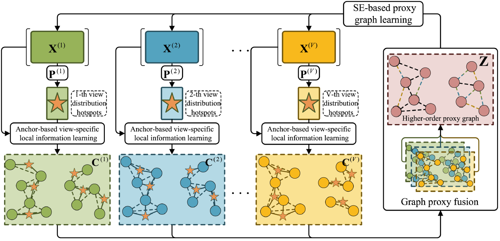

# Graph Proxy Fusion (GPF): Consensus Graph Intermediated Multi-view Local Information Fusion Clustering

This repository contains the implementation of the GPF algorithm as presented in our paper. GPF is a novel multi-view clustering method that effectively preserves and fuses view-specific local information through a unified framework.


## Table of Contents
- [Overview](#overview)
- [Requirements](#requirements)
- [Installation](#installation)
- [Usage](#usage)
- [Citation](#citation)
- [Contact](#contact)

## Overview

GPF addresses two key challenges in multi-view clustering:
1. Preserving view-specific diverse local information
2. Enabling effective negotiation between view-specific information learning and view-consensus information learning

The method consists of three main components:
1. Anchor-based view-specific local information learning
2. SE-based consensus graph learning
3. Graph proxy fusion module

## Requirements

- MATLAB 2018 or later
- C++ compiler (for MEX file compilation)
- Supported operating systems: Windows/Linux/macOS

## Installation

1. Clone this repository:
   ```bash
   git clone [repository_url]
   cd GPF
   ```

2. Compile the required MEX file:
   ```bash
   cd lib
   mex projection.cpp
   ```

3. Add the repository to your MATLAB path:
   ```matlab
   addpath(genpath('/path/to/GPF'));
   ```

## Usage

### Basic Usage
Run the demo script to test GPF on sample data:
```matlab
demo.m
```

### Custom Dataset
To run GPF on your own dataset:
1. Prepare your data in the required format (see [Dataset Format](#dataset-format))
2. Modify `demo.m` to load your dataset
3. Adjust parameters as needed (see [Parameters](#parameters))

## Citation

If you use this code in your research, please cite our paper:
```
@article{li2025graph,
  title={Graph Proxy Fusion: Consensus Graph Intermediated Multi-View Local Information Fusion Clustering},
  author={Li, Haoran and Guo, Yulan and You, Jiali and You, Xiaojian and Ren, Zhenwen},
  journal={IEEE Transactions on Multimedia},
  year={2025},
  doi={10.1109/TMM.2024.3521803}
}
```

## Contact

For questions or issues, please contact:
- Haoran Li: haoranli50@gmail.com

We welcome contributions and feedback to improve this implementation.
